How do you block access to all websites except one on a Windows device?

On-site programming contest organizers need to ensure that the contestant workstations can access [Toph](https://toph.co) but no other website.

Toph recommends restricting the Internet through router/firewall configuration; sometimes, it is not a solution that the contest organizer can choose. At one of the recent divisional programming contests in Bangladesh, the only option was to configure each contestant's workstation to restrict the Internet.

Windows Defender Firewall is configurable, and you can restrict Internet access to a single website in a few steps.

With Windows Defender Firewall, we will use IP addresses to configure the restriction. Not domain names. If the IP addresses host multiple websites, then all of those websites will be accessible.

Assuming we will block access to the Internet, leaving only toph.co accessible, here are the steps:

_**Warning:** The reason this guide exists here and not at [Toph Help](https://help.toph.co) is that this method of restricting Internet access is not something Toph recommends and must be used only as a last resort (with sufficient volunteers invigilating the contest site)._

## Lookup the IP Addresses for Toph (toph.co)

Navigate to [https://dots.fsapp.co/toph.co/a](https://dots.fsapp.co/toph.co/a) or run in Command Prompt:

``` Batchfile {linenos=false}
nslookup toph.co
```

Make a note of the A records of toph.co. As of writing this post, there are two IP addresses:

- 172.104.169.81
- 172.104.160.52

## Change Default State for Outgoing Connections

[Open "Windows Defender Firewall with Advanced Security"](https://learn.microsoft.com/en-us/windows/security/threat-protection/windows-firewall/open-windows-firewall-with-advanced-security).

Right-click on the "Windows Defender Firewall with Advanced Security on Local Computer" from the left pane and click "Properties".

Under the "Domain Profile" tab, make sure "Outbound Connections" is set to "Block".


Under the "Private Profile" tab, make sure "Outbound Connections" is set to "Block".


Under the "Public Profile" tab, make sure "Outbound Connections" is set to "Block".

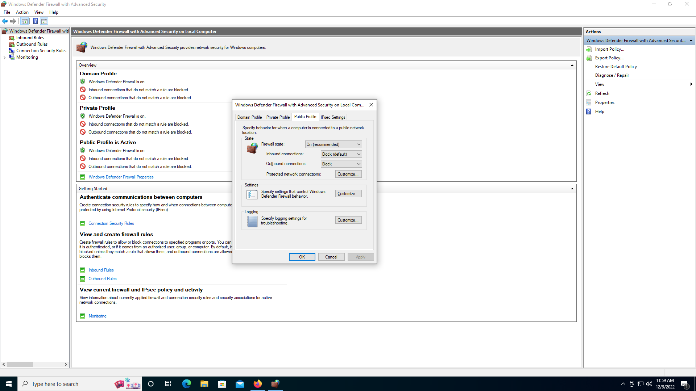
## Add Exception for Toph's IP Addresses


Right-click on "Outbound Rules" from the left pane. And then Click on "New Rule...".

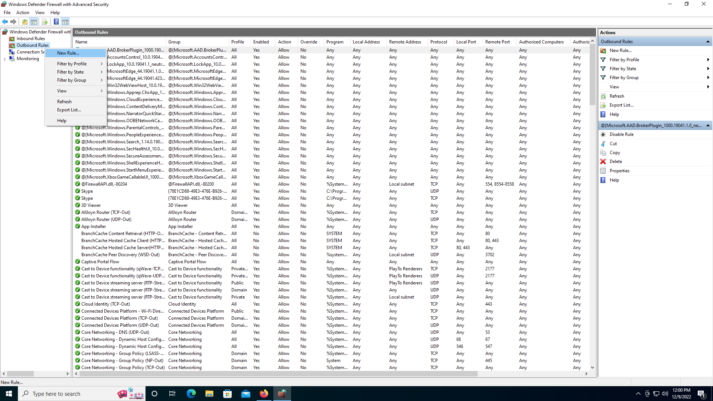

Choose "Custom" for "Rule Type". Click "Next".

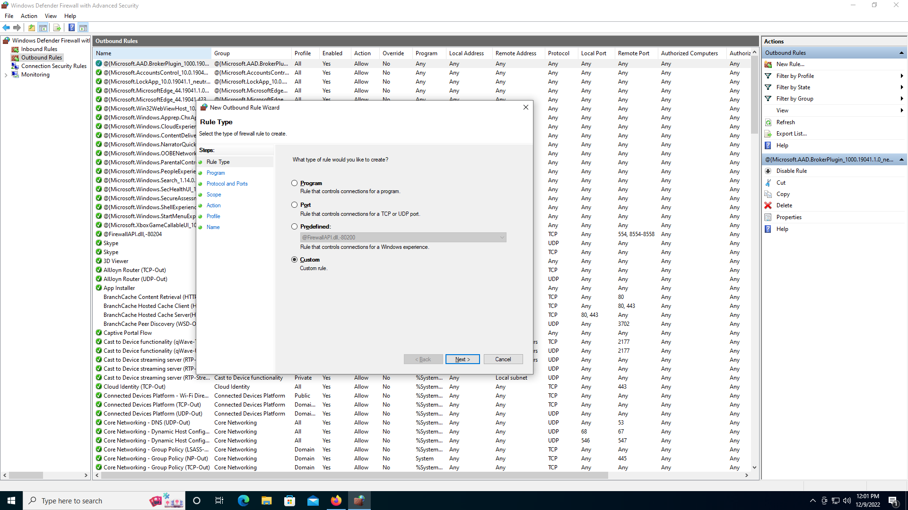

Choose "All programs". Click "Next".

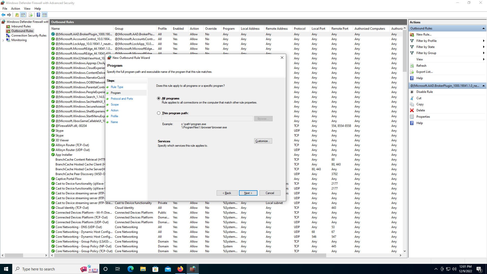

Choose "Any" for "Protocol type". Click "Next".

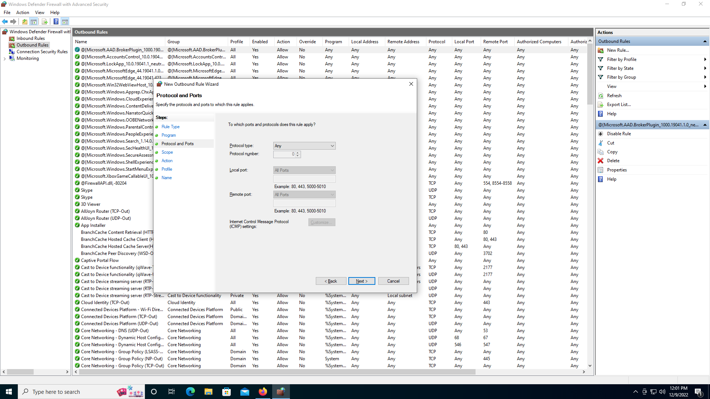

Click on the second "Add" button. The button is under the "Which remote IP addresses does this rule apply to?" section.

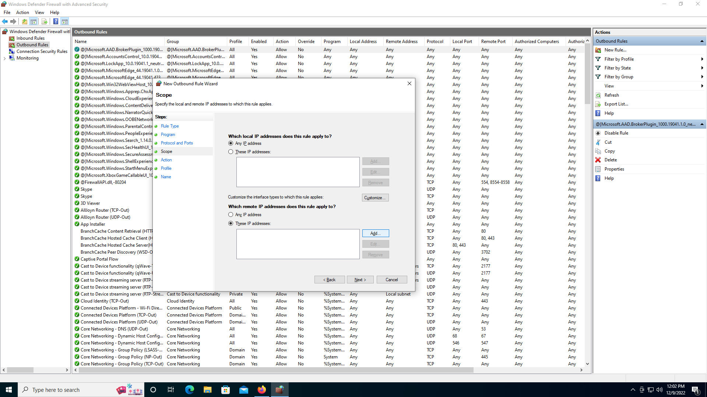

Enter the first IP address of Toph: 172.104.160.52. Click "OK".


Repeat Step 2E, and enter the second IP address of Toph: 172.104.169.81. Click "OK".

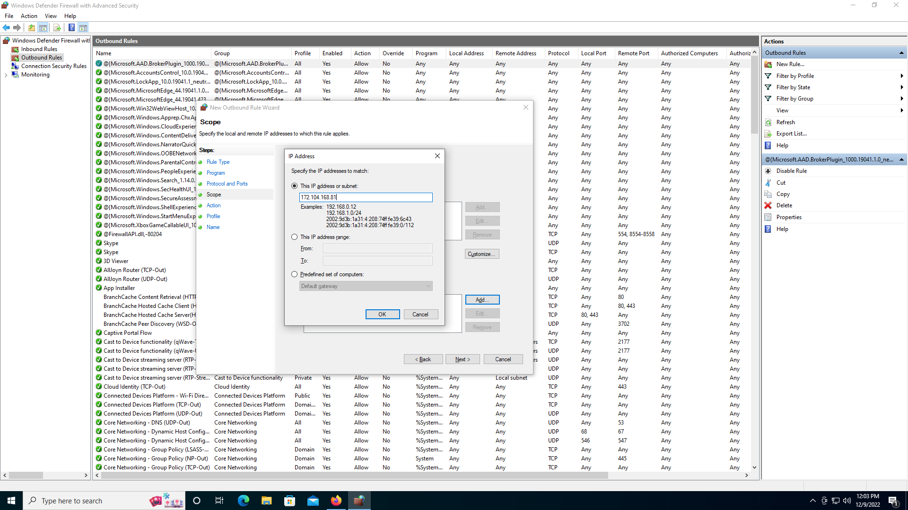

Ensure that both IP addresses are added to the list of "remote IP addresses".

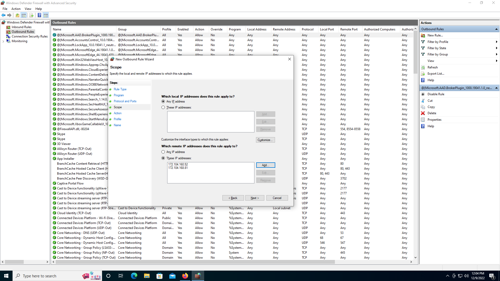

Choose "Allow the connection". Click "Next".

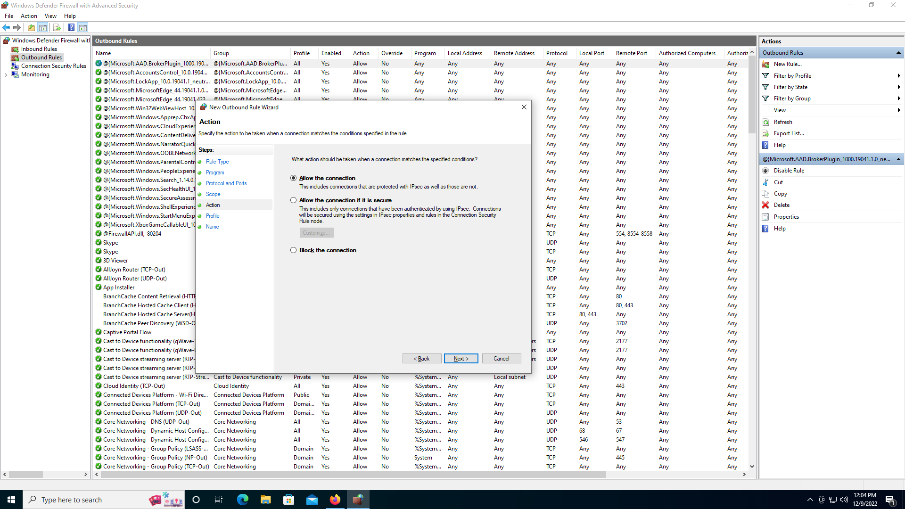

Ensure all three profiles are checked.

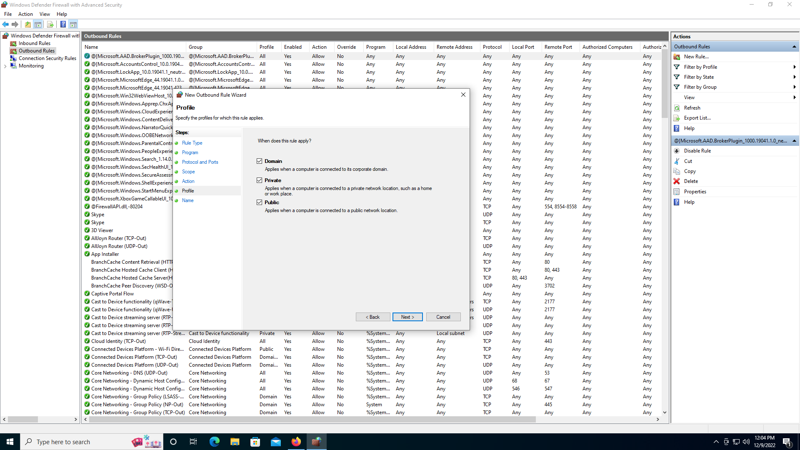

Enter a name for this rule: "Whitelist Toph". Click "Finish".

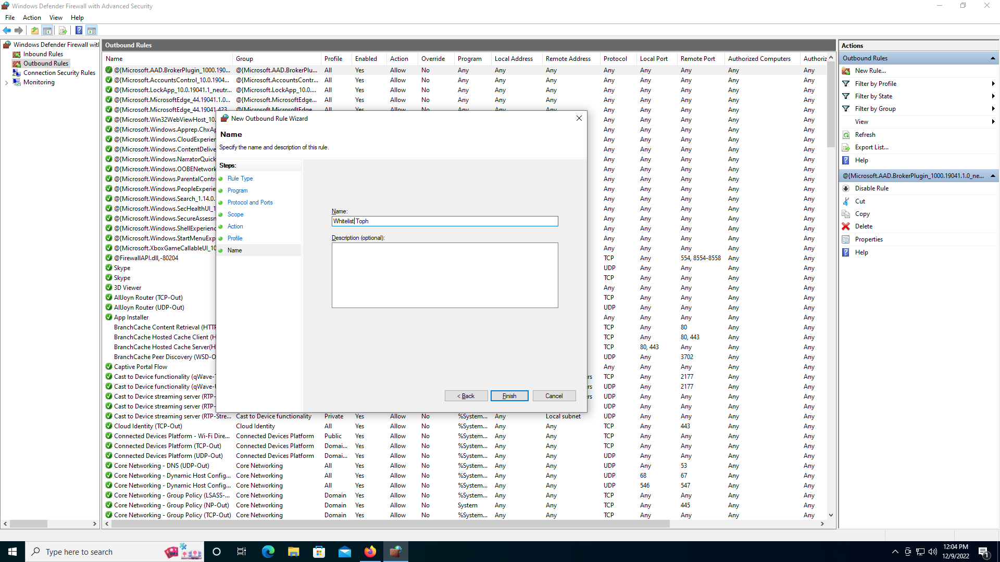

## You Now Have Restricted Internet Access to Toph Only

This should block access to _all_ websites except Toph on a Windows device.

<br>

_This post is 8th of my [#100DaysToOffload](/tags/100daystooffload/) challenge. Want to get involved? Find out more at [100daystooffload.com](https://100daystooffload.com/)._
