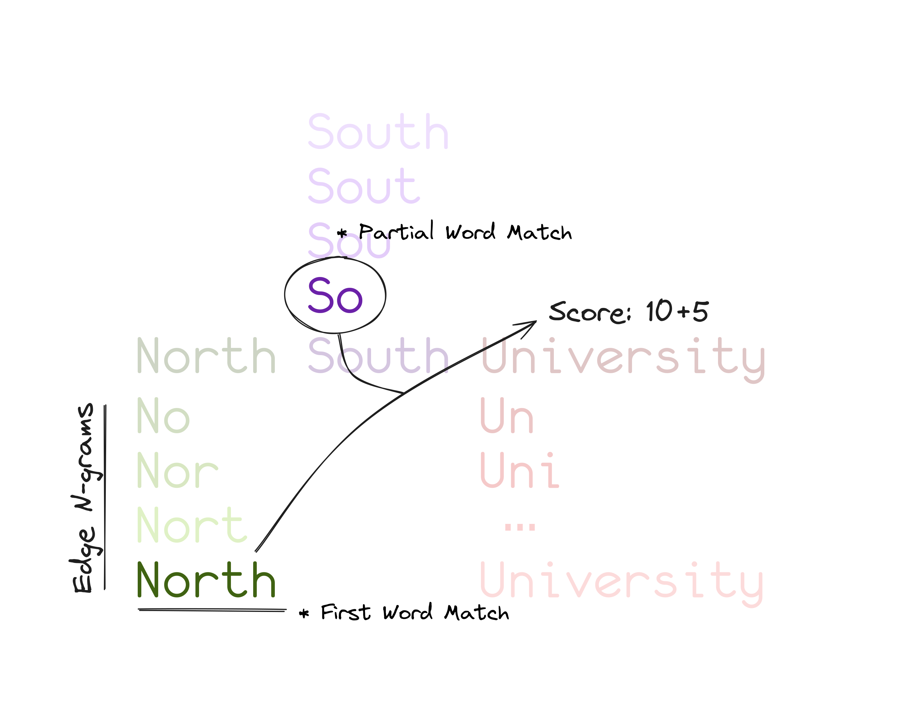

I like software that just works. If I type "North South" into a search box, I expect to find "North South University". But if I type "North So", I should still find it. Maybe not at the top, but it should be there.

For a while, Toph's institution search did not work that way.

## The Problem With MongoDB Text Indexes

The original implementation used a MongoDB text index on the `name` field. It is the obvious first choice. MongoDB makes it easy to set up, and for simple use cases, it works fine.

But text indexes in MongoDB are word-based. To match a document, you need to match whole words. Partial words do not work.

So if you typed "North", MongoDB would not match "North South University" unless "North" happened to be a complete word in the indexed text, which it is, but then it would rank it alongside every other institution with "North" in the name, and not necessarily put the best match first.

Typing "North So" to find "North South University"? No luck. The text index does not know what to do with "So".

This made searching for institutions frustrating. You had to know enough of the full name to get results. Not ideal.

## Pregenerate and Score

The fix came in two parts.

**First**: pregenerate search terms when saving an institution, storing them in a `search_terms` field on the model. Instead of relying on MongoDB to tokenize the name at query time, we do it ourselves at write time.

**Second**: at query time, score each match using simple arithmetic and sort by that score.



Let me walk through both.

## Generating Search Terms

The `Institution` model now has a `SearchTerms` field:

```go
type Institution struct {
    // ...
    SearchTerms []string `bson:"search_terms"`
    // ...
}
```

When saving an institution, `ResetSearchTerms` is called to populate this field:

```go
func (i *Institution) ResetSearchTerms() {
    unique := make(map[string]bool)

    text := i.Name + " " + i.ShortName
    reg := regexp.MustCompile(`[^a-z0-9\s]+`)
    clean := reg.ReplaceAllString(strings.ToLower(text), "")

    words := strings.Fields(clean)
    for _, word := range words {
        grams := GenerateEdgeNGrams(word, 2)
        for _, g := range grams {
            unique[g] = true
        }
    }

    i.SearchTerms = slices.Collect(maps.Keys(unique))
}
```

We take the full name and short name, strip non-alphanumeric characters, split into words, and then generate edge n-grams from each word starting at a minimum length of 2. Both the name and the short name are included, so searching for either "North South University" or "NSU" produces n-grams that match.

The `GenerateEdgeNGrams` function itself is simple:

```go
func GenerateEdgeNGrams(input string, minLen int) []string {
    var ngrams []string
    runes := []rune(strings.ToLower(input))
    for i := minLen; i <= len(runes); i++ {
        ngrams = append(ngrams, string(runes[0:i]))
    }
    return ngrams
}
```

Edge n-grams are the prefixes of a word. For "north", the edge n-grams would be: "no", "nor", "nort", "north". For "south": "so", "sou", "sout", "south". And so on.

This means a query for "No" or "Nor" will match "North South University" because the `search_terms` array will contain those n-grams.

The `Put` method calls `ResetSearchTerms` before saving, so this always stays up to date:

```go
func (i *Institution) Put(ctx context.Context) error {
    i.ResetSearchTerms()
    i.ModifiedAt = time.Now()
    // ...
}
```

A simple index on `search_terms` makes the lookup fast:

```go
ixInstitutionSearchTermsA = mongo.IndexModel{
    Keys: bson.D{{"search_terms", 1}},
}
```

## Searching With Scoring

The `ListInstitutionsText` function handles the actual search. It takes the query text, splits it into terms, and builds a MongoDB aggregation pipeline.

First, the match stage filters documents where the `search_terms` array contains all the query terms:

```go
{
    "$match": bson.D{
        {Key: "search_terms", Value: bson.D{{Key: "$all", Value: terms}}},
    },
},
```

Requiring all terms to match means that typing "nor sou" will match only institutions that have both "nor" and "sou" (or their superstrings) in their search terms, not every institution with either word.

Then we add a score field using `$addFields`. The score is a sum of several conditions:

```go
scoreparts := bson.A{
    bson.D{{Key: "$cond", Value: bson.A{
        bson.D{{Key: "$eq", Value: bson.A{bson.D{{Key: "$toLower", Value: "$short_name"}}, strings.ToLower(text)}}},
        20, 0,
    }}},
}
for _, term := range terms {
    escaped := regexp.QuoteMeta(term)
    scoreparts = append(scoreparts, bson.D{{Key: "$cond", Value: bson.A{
        bson.D{{Key: "$gt", Value: bson.A{
            bson.D{{Key: "$indexOfCP", Value: bson.A{bson.D{{Key: "$toLower", Value: "$name"}}, term}}},
            -1,
        }}},
        bson.D{{Key: "$cond", Value: bson.A{
            bson.D{{Key: "$regexMatch", Value: bson.D{
                {Key: "input", Value: "$name"},
                {Key: "regex", Value: "(?i)(^|\\s)" + escaped},
            }}},
            10,
            5,
        }}},
        0,
    }}})
}
```

The scoring rules are straightforward:

- +20 if the query exactly matches the institution's short name (e.g., typing "NSU" to find "North South University")
- +10 for each query term that matches at the start of the name
- +5 for each query term that appears anywhere in the full name

So "North" typed as a query gives "North South University" a score of 10 because "north" is a word-start match. An institution where "north" appears buried mid-word would score only 5. The better match floats to the top.

The final pipeline sorts by score descending, then name ascending as a tiebreaker:

```go
{
    "$sort": bson.D{
        {Key: "score", Value: -1},
        {Key: "name_lower", Value: 1},
    },
},
{"$skip": skip},
{"$limit": limit},
```

## The Result

Now, when you type "North So" in the institution search on Toph, you get "North South University" right at the top. Typing just "NSU" matches the short name exactly and scores +20, jumping straight to the front. Partial words work. Relevance ordering works.

The approach of pregenerating at write time and scoring at read time is simple but covers the cases that matter. And since the heavy lifting happens at write time and the `search_terms` index is a plain array index, the query performance stays reasonable even as the dataset grows.
