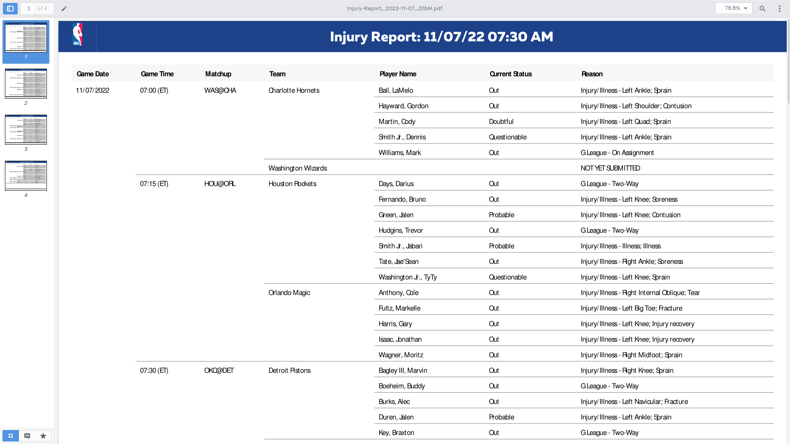

TL;DR: Read all text values from PDF, ordered by Y-position. Make a state machine. The link to the complete code is at the end of the article.

When it comes to extracting text from PDF, you will likely face one of these two scenarios:

1. The PDF you generate or export from some software where all the text is still text.
2. The PDF you scan from a physical document, and what you have is an image in a PDF document.

If it is a scanned PDF, this is an Optical Character Recognition (OCR) task. You will need to use a tool like Tesseract to extract the text from the image.

However, this article is about the former: extracting text values from the PDF. This article will not go into the details of how PDF files are encoded. Instead, we will use a handy PDF parsing Go package by [dslipak](https://github.com/dslipak): [github.com/dslipak/pdf](https://pkg.go.dev/github.com/dslipak/pdf).

## Example PDF

And, Let's take a look at a sample PDF: [Injury-Report_2022-11-07_07AM.pdf](https://ak-static.cms.nba.com/referee/injury/Injury-Report_2022-11-07_07AM.pdf) from nba.com.



This PDF is a report on NBA player injuries. It has a tabular structure. Let's extract each player injury incident in a structured format. For each injury, we want a `struct` like this:

``` go
type Injury struct {
	GameDate      string
	GameTime      string
	Matchup       string
	Team          string
	PlayerName    string
	CurrentStatus string
	Reason        string
}
```

## Parsing PDF in Go

With dslipak's Go package [github.com/dslipak/pdf](https://pkg.go.dev/github.com/dslipak/pdf), you can take a PDF and get all its text groupred either as rows (vertical position of the text) or as columns (horizontal position of the text). What does it mean? Let's see in the code:

``` go
// Error handling omitted for brevity.
r, _ := pdf.Open("Injury-Report_2022-11-07_07AM.pdf")
for no := 1; no < r.NumPage(); no++ { // Loop over each page.
	for ri, row := range rows { // Loop over each row of text in the page.
		for _, text := range row.Content { // Loop over each piece of text in the row.
			// ...
		}
	}
}
```

With these three nested loops, we can take each text on the document row-by-row.

Note that the word "row" here doesn't imply the row on the table. The package considers two pieces of text to be on the same row when they are in the same position on the vertical axis. Since the PDF we are working on here is tabular, pieces of text on the same table row naturally appear on the same vertical axis.

What next? We need a reliable way to associate all these pieces of text we can extract from the PDF to specific player injury incidents.

## State Machine

Let's bring in a state machine.

As we go through the stream of text pieces, we keep track of the type of text piece we have seen, and when going through a row that describes a player injury, the various details of the incident (date, time, team name, player name, etc.).

Our state will look something like this:

``` go
type State struct {
	LastType   TextType
	ReportDate string
	Injury     Injury
}
```

We will also define a set of text types as seen in the PDF document:

``` go
type TextType int

const (
	TextUnknown = iota
	TextRowBreak
	TextReportDate
	TextHeader
	TextGameDate
	TextGameTime
	TextMatchup
	TextTeamName
	TextPlayerName
	TextCurrentStatus
	TextReason
)
```

And, like any neat state machine implementation, we need a `switch` block. This `switch` block goes right inside the inner-most loop of our code:

``` go
r, _ := pdf.Open("Injury-Report_2022-11-07_07AM.pdf")
var state State
for no := 1; no < r.NumPage(); no++ {
	for ri, row := range rows {
		for _, text := range row.Content {
			switch {} // ← Here.
		}
	}
}
```

Let's start with the first case:

``` go
reInjuryReport = regexp.MustCompile(`Injury Report: (\d{2}/\d{2}/\d{2} \d{2}:\d{2} (A|P)M)`)

switch {
	case reInjuryReport.MatchString(text.S):
		state.LastType = TextReportDate
		m := reInjuryReport.FindStringSubmatch(text.S)
		state.ReportDate = m[1]

	// ...
}
```

If you look at the PDF, the document starts with a blue row at the top. It has the text "Injury Report: 11/07/22 07:30 AM". We build a regular expression that matches that text and captures the date/time. When the state machine finds this text, it sets `LastType` in `state` to `TextReportDate` and keeps the date/time it finds in `ReportDate`.

Let's look at the next case:

``` go
reHeaders = regexp.MustCompile(`^(Game Date|Game Time|Matchup|Team|Player Name|Current Status|Reason)$`)

switch {
	// ...

	case (state.LastType == TextHeader || state.LastType == TextRowBreak) && reHeaders.MatchString(text.S):
		state.LastType = TextHeader

	// ...
}
```

What does this case do? If the last seen text type was either `TextHeader` or `TextRowBreak` (that we will use to indicate the end of a row), and the text matches one of the known headers (as matched by the regular expression), it sets `LastType` in `state` to `TextHeader`. As the code loops over the following few pieces of texts, `LastType` in `state` naturally stays `TextHeader`.

But what's with `TextRowBreak`? Where do we set that? We set it at the end of the loop of the row:

``` go
r, _ := pdf.Open("Injury-Report_2022-11-07_07AM.pdf")
var state State
for no := 1; no < r.NumPage(); no++ {
	for ri, row := range rows {
		for _, text := range row.Content {
			switch {
				// ...
			}
		}
		state.LastType = TextRowBreak // ← Here.
	}
}
```

When encountering the first text piece of every following row, the state machine will already have the last type set to `TextRowBreak`.

We have now scanned over the header bit of the document. Now's the exciting bit.

``` go
reGameDate = regexp.MustCompile(`\d{2}/\d{2}/\d{2}`)

switch {
	// ...

	case (state.LastType == TextHeader || state.LastType == TextRowBreak) && reGameDate.MatchString(text.S):
		state.LastType = TextGameDate
		state.Injury.GameDate = text.S

	// ...
}
```

If the last seen type of text piece is `TextHeader`, and the text matches a game date (as matched by the regular expression), then we set `LastType` in `state` accordingly, and we keep this text as `GameDate` in `state.Injury`. We have captured the first bit of _juicy_ injury detail.

Do you see the pattern here? The state machine makes it easy to react to each piece of text as it comes from the stream while having the context of everything you have stored in `state` so far.

Let's add another case. We want to capture the game time.

``` go
reGameTime = regexp.MustCompile(`\d{2}:\d{2} \([A-Z]{2}\)`)

switch {
	// ...

	case (state.LastType == TextGameDate || state.LastType == TextRowBreak) && reGameTime.MatchString(text.S):
		state.LastType = TextGameTime
		state.Injury.GameTime = text.S

	// ...
}
```

Just like before, we are making sure that the last text type we have seen is `TextGameDate` (i.e. the last thing we did is record a game date), and now the text we have at hand matches the regular expression for the game time.

And you keep adding cases like these to define the structure of your PDF document programmatically:

- If the last text was a header and the current text looks like a date, we have the game date.
- If the last text was a game date and the current text looks like a time, we have the game time.
- And, so on...

If you want to add a few more cases, go for it. I will wait here.

Done? Awesome!

Let's see what the remaining cases would look like:

``` go
reMatchup = regexp.MustCompile(`[A-Z]{3}@[A-Z]{3}`)

switch {
	// ...

	case state.LastType == TextGameTime && reMatchup.MatchString(text.S):
		state.LastType = TextMatchup
		state.Injury.Matchup = text.S

	case state.LastType == TextMatchup /* && isTeamName(text.S) */ :
		state.LastType = TextTeamName
		state.Injury.Team = text.S

	case state.LastType == TextTeamName /* && isPlayerName(text.S) */ :
		state.LastType = TextPlayerName
		state.Injury.PlayerName = text.S

	case state.LastType == TextRowBreak && text.S != "Game Date" /* && isPlayerName(text.S) */ :
		state.LastType = TextPlayerName
		state.Injury.PlayerName = text.S

	case state.LastType == TextPlayerName /* && isCurrentStatus(text.S) */ :
		state.LastType = TextCurrentStatus
		state.Injury.CurrentStatus = text.S

	case state.LastType == TextCurrentStatus: // Assuming Reason always appears after Current Status.
		state.LastType = TextReason
		state.Injury.Reason = text.S
}
``` 

Our state machine continues:

- If the last text was a game time and the current text looks something like "ABC@XYZ", then we have the matchup.
- If the last text was a matchup, then we have the team name. The team name always appears after the matchup. We could maintain a list of valid team names to compare against if we wanted to for extra validation.
- If the last text was the team name, then we have the player name.
- We also have the player name if the last text type was `TextRowBreak` and the current text is not "Game Date". Why check the current text like that? Because we don't want the state machine to think that "Game Date" (a possible header of the table that appears at the beginning of a row) is a player name.
- If the last text is a player name, then the one at hand must be the current status.
- If the last text is a current status, then the one at hand must be the reason.

And voila! The state machine can now scan through the PDF in a structured manner. 

## Parsed Output

"But we have only scanned through the PDF and stored data in `state.Injury`. Where's my slice of injuries?" you say.

Well, that's the easiest part. Every time you reach the end of the row, look at `PlayerName` in `state.Injury`. If it is not an empty string (i.e. you have a player name there), then you have a freshly extracted injury detail in your state. Append that to a slice and reset some bits of state. Like so:

``` go
r, _ := pdf.Open("Injury-Report_2022-11-07_07AM.pdf")
var (
	injuries []Injury
	state State
)
for no := 1; no < r.NumPage(); no++ {
	for ri, row := range rows {
		for _, text := range row.Content {
			switch {
				// ...
			}
		}

		// Here:
		if state.Injury.PlayerName != "" && state.LastType == TextReason {
			injuries = append(injuries, state.Injury)
			state.Injury.PlayerName = ""
			state.Injury.CurrentStatus = ""
			state.Injury.Reason = ""
		}

		state.LastType = TextRowBreak
	}
}
```

And here is what the parsed slice looks like:

``` go
[]Injury{
	{
		GameDate:      "11/07/2022",
		GameTime:      "07:00 (ET)",
		Matchup:       "WAS@CHA",
		Team:          "Charlotte Hornets",
		PlayerName:    "Ball, LaMelo",
		CurrentStatus: "Out",
		Reason:        "Injury/Illness - Left Ankle; Sprain",
	},
	{
		GameDate:      "11/07/2022",
		GameTime:      "07:00 (ET)",
		Matchup:       "WAS@CHA",
		Team:          "Charlotte Hornets",
		PlayerName:    "Hayward, Gordon",
		CurrentStatus: "Out",
		Reason:        "Injury/Illness - Left Shoulder; Contusion",
	},
	// ...
}
```

There you go. Now you know how to use dslipak's Go package for parsing PDFs and a state machine to extract text in a structured way from a PDF.

## Full Code

For those who want to see the entire code: [parsepdf.go](parsepdf.go).
