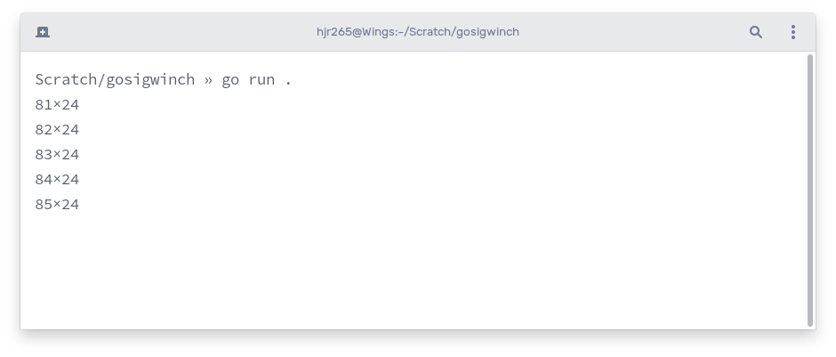

I have been meaning to do a few short-form blog posts lately. This blog post is going to be one of them.

In Go, on Linux, if you want to know when the terminal window is resized, you can listen for the `SIGWINCH` signal using the `signal.Notify` (or the `signal.NotifyContext`) function.

The code will look something like this:

``` go
ch := make(chan os.Signal)
signal.Notify(ch, syscall.SIGWINCH)
for range ch {
  // The terminal has been resized.
}
```

For a bit more complete example, you can try out this Go code:

``` go
package main

import (
  "fmt"
  "os"
  "os/signal"
  "syscall"
  "unsafe"
)

func main() {
  ch := make(chan os.Signal)
  signal.Notify(ch, syscall.SIGWINCH)
  for range ch {
    w, h, _ := termSize()
    fmt.Printf("%d×%d\n", w, h)
  }
}

func termSize() (w, h int, err error) {
  var dim [4]uint16
  _, _, errno := syscall.Syscall(syscall.SYS_IOCTL, uintptr(os.Stdout.Fd()), uintptr(syscall.TIOCGWINSZ), uintptr(unsafe.Pointer(&dim)))
  if errno != 0 {
    err = errno
  }
  return int(dim[1]), int(dim[0]), err
}
```

It will print the size of the terminal every time it is resized.



That's it.

As I said in the beginning, I have been meaning to do some short-form blog posts. And, this post is as short as it can get.
