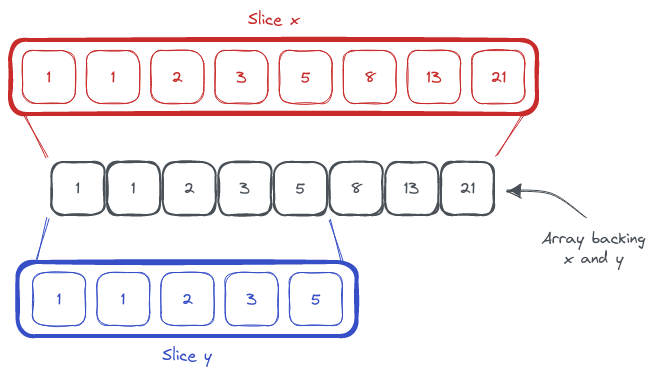

At launch, Go did many things that felt out of place next to the other popular programming languages of the era. But now, those same language features feel so natural that I find it hard to think of a time without them.



One such feature is the slice type. In Go, a slice is a view of an array. And naturally, you can have multiple slices backed by the same array:

``` go
x := []int{1, 1, 2, 3, 5, 8, 13, 21}
y := x[:5]

len(x) // == 8
len(y) // == 5
```

The length of the slice `x` is 8. The length of the slice `y` is 5. But both `x` and `y` are backed by the same array. If you were to change the value of `x[3]`, the value of `y[3]` would also change. Here `y` is a 5-element slice of the array backing `x`.

But you can also make a zero-element slice.

``` go
x := []int{1, 1, 2, 3, 5, 8, 13, 21}
y := x[:0]

len(x) // == 8
len(y) // == 0
```

At first, a zero-element slice may not feel very useful. You cannot access any element of the array through `y`. But, you can `append` to it.

``` go
x := []int{1, 1, 2, 3, 5, 8, 13, 21}
y := x[:0]

len(y) // == 0

y = append(y, 99)

len(y) // == 1
x[0] // == 99
y[0] // == 99
```

Now you can see where this is going and how you can filter slices without keeping two indexes like the _old fashion way_.

``` go
func FilterIntsEven(x []int) []int {
	r := x[:0]
	for _, v := range x {
		if v % 2 == 0 {
			r = append(r, v)
		}
	}
	return r
}
```

This function does not allocate a new array. The slice `r` uses the same array that backs `x`.

And, for those who like to use generics in Go:

``` go
func Filter[T any](x []T, f func(T) bool) []T {
	r := x[:0]
	for _, v := range x {
		if f(v) {
			r = append(r, v)
		}
	}
	return r
}
```
