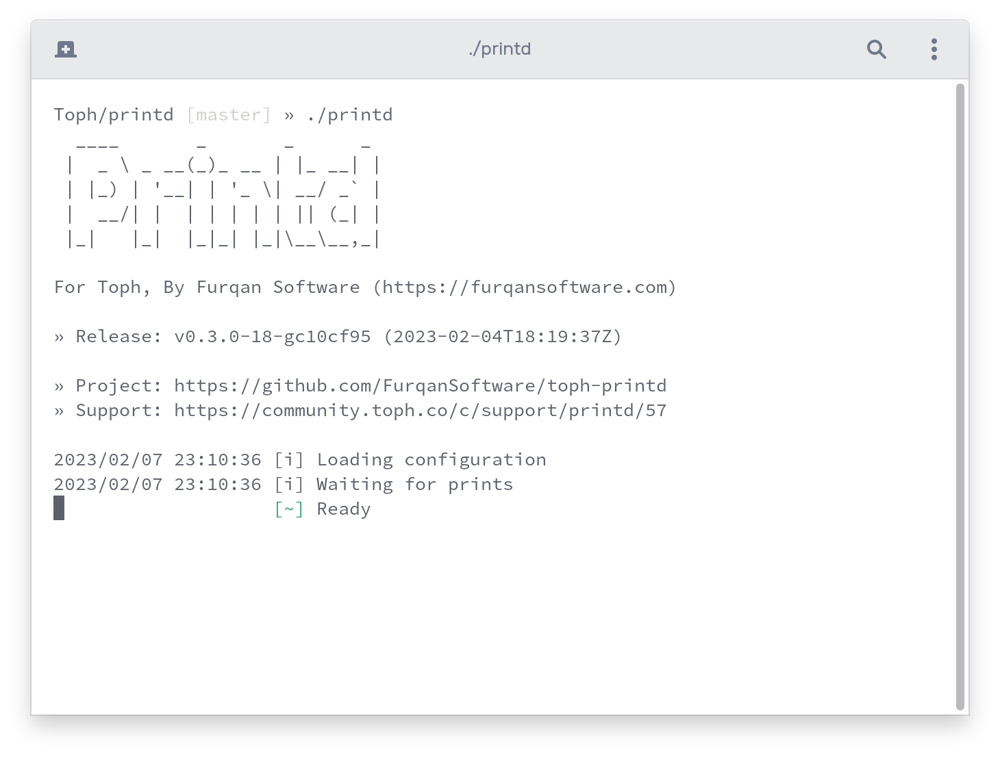

Last week I was working on a Go program. I wanted it to print the closest Git tag and build time to logs at startup.

I could write a small script that generates a Go file with these two variables set right before building the Go program.

But, Go makes it easier.

## Ldflags

Say you have the following Go code:

``` go
package main

var hello string

func main() {
  println(hello)
}
```

You can build it like so:

``` txt {linenos=false}
go build -ldflags "-X main.hello=HelloGo" -o a.out .
```

And run it:

``` txt {linenos=false}
./a.out
```

The program will print `HelloGo`.

## Package Path

You can set any string variable with `ldflags`. Just make sure to prefix the variable name with the complete package path.

For example, if your package path is `github.com/FurqanSoftware/example/cfg` and the variable name is `BuildTag`, then your `ldflags` should look like this:

``` txt {linenos=false}
-X github.com/FurqanSoftware/example/cfg.BuildTag=TagGoesHere
```

## Makefile

In the Go program that I was working on, I added a small `Makefile`:

``` Makefile
BUILD_TAG := $(shell git describe --tags)
BUILD_TIME := $(shell date -u '+%Y-%m-%dT%H:%M:%SZ')

.PHONY: printd
printd:
  go build -ldflags "-X main.buildTag=$(BUILD_TAG) -X main.buildTime=$(BUILD_TIME)" -o printd .
```

Now, if I run `make printd`, the resulting binary will have the two variables `buildTag` and `buildTime` set to the closest Git tag and the time when the binary was built.

Here's what the Go program now prints to the log at startup:



(The line "Release" has the build tag and time.)

<br>

_This post is 16th of my [#100DaysToOffload](/tags/100daystooffload/) challenge. Want to get involved? Find out more at [100daystooffload.com](https://100daystooffload.com/)._
