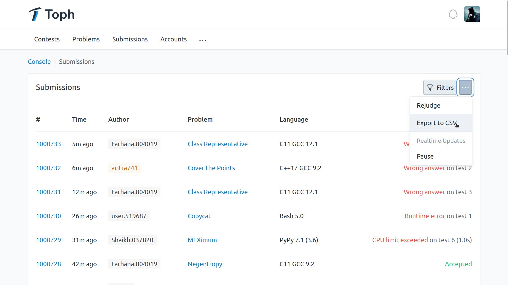

Toph recently reached a milestone that my family and I have been looking forward to: [one million submissions](https://blog.toph.co/spotlight/one-million-submissions/). It may be a small win, but for us, it is that sweet reward of working on a project with passion and diligence.

On the Toph Blog post where the programming making the one-millionth submission is congratulated, we have a particular image, quite a large one. The picture is W×H pixels and has one million coloured squares on it. The squares represent the one million submissions and are green for correct (Accepted) submissions and red for any other incorrect (Wrong Answer, CPU Limit Exceeded, etc.) submissions.

So how was the image generated?

First, I took a CSV export of the one million submissions. In the export, I included the Verdict column; that's what we need.



Next, I wrote a small Go program that looped over this list of verdicts, drawing squares from left to right, top to bottom. Error handling has been omitted from the snippet below for brevity.

``` go
var (
  filename = flag.String("f", "manifest.txt", "name of manifest file")
  output   = flag.String("o", "background.png", "name of output file")

  imgwidth  = flag.Int("iw", 1200*2, "width of output image")
  imgheight = flag.Int("ih", 630*2, "height of output image")

  dotsize = flag.Int("ds", 16, "size of each dot")
)

func main() {
  flag.Parse()

  // Make an empty image with all white pixels.
  img := image.NewRGBA(image.Rect(0, 0, *imgwidth, *imgheight))
  drawDot(img, 0, 0, *imgwidth, *imgheight, color.RGBA{255, 255, 255, 255})

  f, _ := os.Open(*filename)
  defer f.Close()

  // Open and loop over each line in the verdict manifest file.
  sc := bufio.NewScanner(f)
  sc.Split(bufio.ScanLines)
  var px, py int
  for sc.Scan() {
    switch sc.Text() {
    case "Accepted":
      // Draw a green square for Accepted submissions.
      drawDot(img, px, py, px+*dotsize, py+*dotsize, color.RGBA{0x26, 0xc2, 0x81, 255})
    default:
      // Draw a red square for all other submissions.
      drawDot(img, px, py, px+*dotsize, py+*dotsize, color.RGBA{0xe3, 0x5b, 0x5a, 255})
    }

    // Determine the position of the next square.
    px += *dotsize
    if px > *imgwidth {
      px = 0
      py += *dotsize
    }
  }
  catch(sc.Err())

  // Save the image as PNG.
  outf, _ := os.Create(*output)
  defer outf.Close()
  png.Encode(outf, img)
}

func drawDot(img *image.RGBA, x0, y0, x1, y1 int, c color.Color) {
  // Set all pixels within (x0, y0) and (x1, y1) to the colour c, except the right-most column and bottom-most row of pixels.
  for y := y0; y < y1-1; y++ {
    for x := x0; x < x1-1; x++ {
      img.Set(x, y, c)
    }
  }
}
```

I added some flags to the command to make it easy to toy around with the image's dimensions and the size of the dots.

It is no Monalisa, but hey, it looks neat. Although it reminds me of the disk defragmentation utility from the Windows 9x era.

I am sharing the Go code and the list of one million verdicts in this GitHub repository: [hjr265/toph-million](https://github.com/hjr265/toph-million).

<br>

_This post is 3rd of my [#100DaysToOffload](/tags/100daystooffload/) challenge. Want to get involved? Find out more at [100daystooffload.com](https://100daystooffload.com/)._
