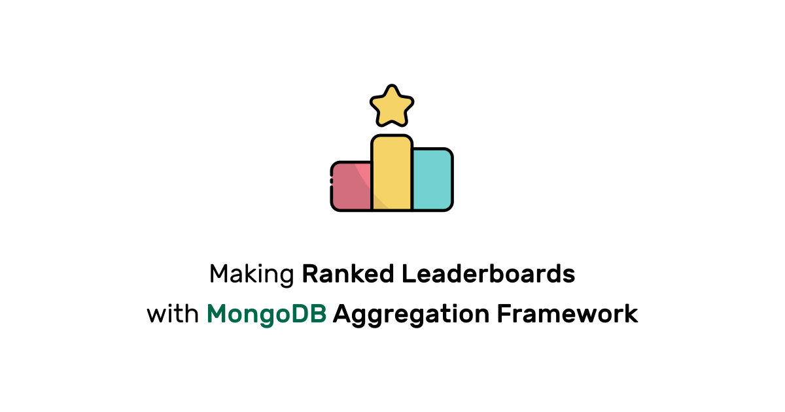

When I first added the [leaderboard on Toph](https://toph.co/leaderboard) several years ago, I had to do most of the leaderboard-related things in application code. But then MongoDB introduced the `$setWindowFields` aggregation operator in MongoDB 5.0. And it simplified so much when it came to implementing ranked leaderboards.

One of the things that I had to do in the application code was to calculate the rank of the leaderboard entries.



In this tutorial, we will see how the same can be done using MongoDB's aggregation pipelines.

## Setting the Stage

Let's start with the assumptions. You have a collection named `rounds` that look something like this:

``` json
{"player1": "Alice", "player2": "Bob",   "winner": "Alice"}
{"player1": "Alice", "player2": "Carol", "winner": "Alice"}
{"player1": "Bob",   "player2": "Carol", "winner": "Bob"}
{"player1": "Carol", "player2": "Ted",   "winner": "Carol"}
{"player1": "Ted",   "player2": "Bob",   "winner": "Ted"}
{"player1": "Alice", "player2": "Ted",   "winner": "Alice"}
```

This collection holds the pairing details and winner of some game that Alice, Bob, Carol and Ted have been playing.

You also have a collection named `profiles`. This collection holds some additional details about each player.

``` json
{"player": "Alice", "planet": "Mars"}
{"player": "Bob",   "planet": "Mars"}
{"player": "Carol", "planet": "Venus"}
{"player": "Ted",   "planet": "Mars"}
```

## Generating the Leaderboard

To generate the leaderboard, we want to run an aggregation pipeline. We will name the collection `leaderboard`. 

We want this collection to have one document for every player with round statistics and fields denormalized from the `profiles` collection. It should look something like this:

``` json
{"player": "Alice", "won": 3, "planet": "Mars"}
{"player": "Bob",   "won": 1, "planet": "Mars"}
{"player": "Carol", "won": 1, "planet": "Venus"}
{"player": "Ted",   "won": 1, "planet": "Mars"}
```

### Calculating Round Statistics

To run the aggregation, let us look at the pipeline stage by stage. We will run the aggregation pipeline on the `rounds` collection. We will design the pipeline to update the `leaderboard` document for a specific player.

For now, let's assume we want to update the `leaderboard` document for Alice.

In the first stage, we want to filter all the `rounds` documents where Alice is the winner.

``` json {linenos=false}
{ "$match": { "winner": "Alice" } }
```

Next, we want to count the number of documents in the pipeline. After the `$match` stage, this tells us in how many rounds Alice is the winner.

``` json {linenos=false}
{ "$count": { "won" } }
```

The pipeline now has a single document with the number of rounds Alice won. Let's add a `player` field to this document set to "Alice".

``` json {linenos=false}
{ "$addFields": { "player": "Alice" } }
```

We just need to upsert this document to the `leaderboard` collection.

``` json {linenos=false}
{ "$merge": { "into": "leaderboard", "on": "player", "whenMatched": "merge", "whenNotMatched": "insert" } }
```

The entire pipeline will look like this:

``` json
[
  { "$match": { "winner": "Alice" } },
  { "$count": "won" },
  { "$addFields": { "player": "Alice" } },
  { "$merge": { "into": "leaderboard", "on": "player", "whenMatched": "merge", "whenNotMatched": "insert" } }
]
```

Remember that for this pipeline to work, you must have a unique index defined on the `player` field of the `leaderboard` collection. This is necessary for `$merge` to work.

``` js {linenos=false}
db.leaderboard.ensureIndex({ player: 1 }, { unique: true })
```

In your application, this pipeline should be rerun for the winner every time a new game round takes place.

### Denormalizing Profile Fields

This pipeline is slightly more straightforward. The pipeline will run on the `profiles` collection.

We will take a look at it as a whole:

``` json
[
  { "$match": { "player": "Alice" } },
  { "$project": { "_id": 0, "player": 1, "planet": 1 } },
  { "$merge": { "into": "leaderboard", "on": "player", "whenMatched": "merge", "whenNotMatched": "insert" } }
]
```

In the first stage, we find Alice's document in `profiles`.

In the next stage, we only project the `player` and `planet` fields.

We are merging this document to the `leaderboard` table in the final stage.

In your application, this pipeline should be rerun for the player every time their profile is updated.

## Leaderboard with Rank

Now, we want to query the leaderboard, but we also want to include the rank of each document. This is where we need the MonogDB Aggregation Framework again.

When run on the `leaderboard` collection, the following pipeline will add a `rank` field to each document.

``` json
[
  { 
    "$setWindowFields": {
      "sortBy": { "won": -1 },
      "output": {
        "rank": {"$documentNumber": {}}
      },
    }
  }
]
```

The result will look like this:

``` json
{ "player": "Alice", "won": 3, "planet": "Mars",  "rank": 1 }
{ "player": "Bob",   "won": 1, "planet": "Mars",  "rank": 2 }
{ "player": "Carol", "won": 1, "planet": "Venus", "rank": 3 }
{ "player": "Ted",   "won": 1, "planet": "Mars",  "rank": 4 }
```

## Filtered Leaderboard

What if you want to filter the `leaderboard` first by a specific field value. Let's say you want the `leaderboard` for players from the planet Mars. You can prepend a `$match` operator to the pipeline.

``` json
[
  { "$match": { "planet": "Mars" } },
  {
    "$setWindowFields": {
      "sortBy": { "won": -1 },
      "output": {
        "rank": {"$documentNumber": {}}
      },
    }
  }
]
```

The result will look like this:

``` json
{ "player": "Alice", "won": 3, "planet": "Mars", "rank": 1 }
{ "player": "Bob",   "won": 1, "planet": "Mars", "rank": 2 }
{ "player": "Ted",   "won": 1, "planet": "Mars", "rank": 3 }
```

## Dense Rank

If you want players winning the same number of rounds to have the same rank, you can use `$denseRank` instead of `$documentNUmber`.

``` json
[
  { 
    "$setWindowFields": {
      "sortBy": { "won": -1 },
      "output": {
        "rank": { "$denseRank": {} }
      },
    }
  }
]
```

The result will look like this:

``` json
{ "player": "Alice", "won": 3, "planet": "Mars",  "rank": 1 }
{ "player": "Bob",   "won": 1, "planet": "Mars",  "rank": 2 }
{ "player": "Carol", "won": 1, "planet": "Venus", "rank": 2 }
{ "player": "Ted",   "won": 1, "planet": "Mars",  "rank": 2 }
```

## Wrap Up

There you go. You can use these basics to build ranked leaderboards with MongoDB.

In Toph, we make the most out of `$setWindowFields` for leaderboards and contest standings. By distributing the aggregation load across a MongoDB replica set and some application-side caching, you can start serving real-time leaderboards without having MongoDB even break a sweat.

You can learn more about the [`$setWindowFields` aggregation operator](https://www.mongodb.com/docs/manual/reference/operator/aggregation/setWindowFields/) and the [MongoDB Aggregation Framework](https://www.mongodb.com/docs/manual/aggregation/) in general from the official MonogDB documentations.

## Full Code

For those who want to see the entire MongoDB Shell (mongosh) code: [leaderboard.js](leaderboard.js).

<br>

_This post is 18th of my [#100DaysToOffload](/tags/100daystooffload/) challenge. Want to get involved? Find out more at [100daystooffload.com](https://100daystooffload.com/)._
