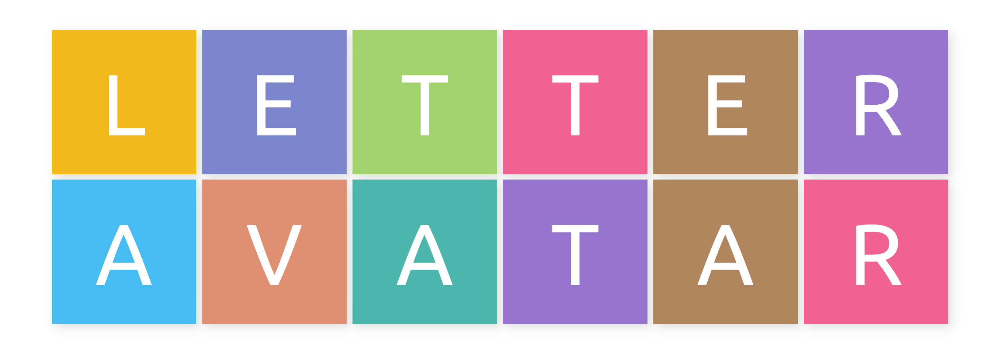

Avatars (also known as profile images) are a great way to represent users in web applications (especially in the ones with social or collaborative features). It's like icons, but for human beings.

But as your application grows, you start to realize that not everyone is quick to upload an avatar for their account.

If your application uses one of those silhouette images as a fallback avatar, then soon you will have more "John Doe" avatars than personalized ones. Not cool to look at when there are 10 avatars side-by-side and they are all this grey human silhouette.

Using letter avatars is one way of providing diverse fallback avatars.



You usually use the first letter of the username or the two-letter initials of a user's full name to generate the avatar. To add some flair, you pick a colour from the predefined palette based on the hash of some user data that is unlikely to change.

For a long time, on [Toph](https://toph.co), letter avatars were generated on the fly. Although the images were cached, there was still a lot of unnecessary work happening on the backend around this.

Late last year this was changed. The images are now being generated as a part of Toph's build process and stored alongside other static assets.

- There are 10 images for each of the 26 letters in upper case, each with a different background colour.
- A grey '-' for temporary accounts.

The code serving avatars was updated to pick one of these images deterministically based on the handle of the user.

To generate these images, I wrote a small Go program. 

``` go
// Error handling omitted for brevity.

package main

import (
  // ...

  "github.com/disintegration/letteravatar"
  "github.com/golang/freetype/truetype"
)

// 26 English alphabets. You can add additional characters here to generate more avatars.
const alpha = "ABCDEFGHIJKLMNOPQRSTUVWXYZ"

// 10 colors. You can add more colours here to generate more avatars.
var palette = []color.Color{
  color.RGBA{213, 217, 221, 255}, // Muted
  color.RGBA{69, 189, 243, 255},
  color.RGBA{224, 143, 112, 255},
  color.RGBA{77, 182, 172, 255},
  color.RGBA{149, 117, 205, 255},
  color.RGBA{176, 133, 94, 255},
  color.RGBA{240, 98, 146, 255},
  color.RGBA{163, 211, 108, 255},
  color.RGBA{121, 134, 203, 255},
  color.RGBA{241, 185, 29, 255},
}

func main() {
  // Use a font file named "ubuntu-r.tff". The file is expected in the current working directory. You can specify an absolute path to it if needed.
  font, _ := openFont("ubuntu-r.ttf")

  os.Mkdir("./avatars")
  for _, initial := range alpha {
    for i, tint := range palette {
      makeAvatar(strings.ToLower(fmt.Sprintf("%c_%d.png", initial, i)), initial, tint, font)
    }
  }
  makeAvatar("tmp_0.png", '-', palette[0], font)
}

func makeAvatar(name string, initial rune, tint color.Color, font *truetype.Font) {
  img, _ := letteravatar.Draw(450, initial, &letteravatar.Options{
    Font:        font,
    Palette:     []color.Color{tint},
    LetterColor: color.RGBA{255, 255, 255, 255},
  })
  buf := bytes.Buffer{}
  png.Encode(&buf, img)
  os.WriteFile(filepath.Join("./avatars/", name), buf.Bytes(), 0755)
}

func openFont(name string) (*truetype.Font, error) {
  f, _ := os.Open(name)
  defer f.Close()
  b, _ := io.ReadAll(f)
  return truetype.Parse(b)
}
```

Running this program will generate 261 images.

You can shave off some additional bytes from these generated images using a program like `optipng`. By running `optipng -o7` on these images we see the size go down from 1.9 MB to 1.1 MB.
