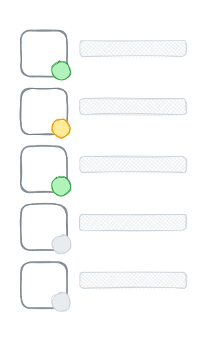

Let's say you are building a chat application. You have everything chalked out. The only thing left is that pesky green-yellow-grey indicator next to everyone's avatar.



With Redis, there is an easy way to track and display the presence of your users. All you need is a Redis sorted set.

> A Redis sorted set is a collection of unique strings (members) ordered by an associated score. [...](https://redis.io/docs/data-types/sorted-sets/)

## Track Last Seen with ZADD

Using [`ZADD`](https://redis.io/commands/zadd/) you can store your user's identifier as a member in a sorted set and the time the user was "last seen" as its score:

``` txt {linenos=false}
ZADD presence {ts} {user-id}
```

``` txt
> ZADD presence 100123 alice
(integer) 1
> ZADD presence 100135 bob
(integer) 1
> ZADD presence 100141 eve
(integer) 1
> ZADD presence 100143 mallory
(integer) 1
> ZADD presence 100163 timmy
(integer) 1
```

If your application is built on WebSockets, the clients can send an authenticated ping regularly. Each time you receive a ping from a user, you can update the user's member in the sorted set:

``` txt {linenos=false}
> ZADD presence 100178 eve
(integer) 0
``` 

In Go, you can have a function that sets presence data:

``` go
// SetPresence takes a namespace (so that you can have multiple sorted sets),
// a key (to identify the user), and a timestamp.
func SetPresence(ctx context.Context, ns string, key string, t time.Time) error {
	return redisClient.ZAdd(ctx, "presence:"+ns, &redis.Z{
		Score:  float64(t.Unix()),
		Member: key,
	}).Err()
}
```

The Go code above uses `github.com/go-redis/redis` and expects a redisClient variable available globally. But you can use any other Redis client.

## Lookup Presence with ZSCORE/ZMSCORE

Next, to display the presence status of the user, you can look up the user's score in the sorted set using [ZSCORE](https://redis.io/commands/zscore/):

``` txt {linenos=false}
ZSCORE presence {user-id}
```

The score, which is the "last seen" timestamp of the user, tells you roughly when the user last sent the ping.

You can define your own rules around this. Perhaps:

- Ping every 30 seconds.
- Status is green if the ping is less than a minute old.
- Status is yellow if the ping is less than 5 minutes old.
- Status is grey if the ping has never been sent or not sent in the last 5 minutes.

In Go:

``` go
// GetPresence returns the "last seen" timestamp for the given namespace and key.
func GetPresence(ctx context.Context, ns string, key string) (time.Time, error) {
	tn, err := redisClient.ZScore(ctx, "presence:"+ns, key).Result()
	if err != nil && err != redis.Nil {
		return time.Time{}, err
	}
	return time.Unix(int64(tn), 0), nil
}
```

If you want to look up the status of multiple users at once, you can always [`ZMSCORE`](https://redis.io/commands/zmscore/) (introduced in Redis 6.2.0).

``` txt {linenos=false}
ZMSCORE presence {user-id-1} {user-id-2} ...
```

## Lookup Recently Seen Users with ZRANGE

What if you want to get a list of users who are currently green? Use [`ZRANGE`](https://redis.io/commands/zrange/).

``` txt {linenos=false}
ZRANGE presence {ts-now} {ts-one-minute-ago} BYSCORE REV
```

Let's say the current timestamp is 100197. Then the Redis call would be:

``` txt
> ZRANGE presence 100197 100137 BYSCORE REV
1) "eve"
2) "timmy"
3) "mallory"
```

The list returned is sorted with the most recently seen user at the top. The order can be changed to be sorted lexicographically by using `BYLEX` instead of `BYSCORE`.

You can use the `LIMIT` parameter to page over the results.

In Go:

``` go
// ListPresence returns the user IDs that were last seen within from and to timestamps.
func ListPresence(ctx context.Context, ns string, from, to time.Time, skip, limit int64) ([]string, error) {
	if from.After(to) {
		return []string{}, nil
	}
	return redisClient.ZRevRangeByScore(ctx, "presence:"+ns, &redis.ZRangeBy{
		Min:    strconv.FormatInt(from.Unix(), 10),
		Max:    strconv.FormatInt(to.Unix(), 10),
		Offset: skip,
		Count:  limit,
	}).Result()
}
```

## Wrap Up

And there you _go_. With a Redis sorted set, you can track the online status of your users for a chat or other similar types of applications.

Note that a sorted set can hold at most 4,294,967,295 (2^32 - 1) members. If you are dealing with that many or more users, you will have to rethink your approach to the solution.
