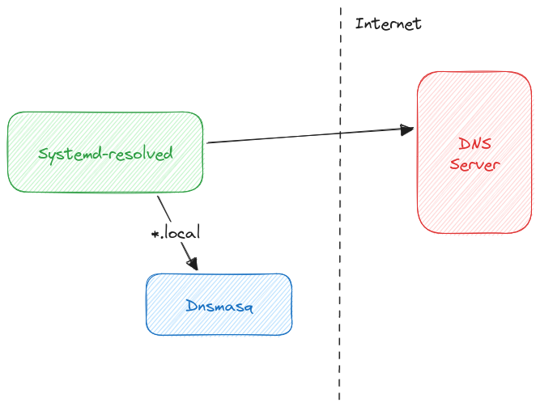

I have lines like these in my `/etc/hosts` file:

``` txt {linenos=false}
127.0.0.1       toph.local
127.0.0.1       drafts.toph.local
127.0.0.1       quiz.toph.local
```

I can run development servers locally and access them over `.local` hostnames (e.g. `toph.local`) instead of the loopback IP addresses (e.g. `127.0.0.1`).

It works fine. But every time I start working on a new project, I needed to add a new line to the `/etc/hosts` file. It didn't sit right with me.

I should be able to point all `*.local` hostnames to a loopback IP address without having to enter each possible hostname. Right?

## Enter Dnsmasq

I can configure Dnsmasq to respond with a loopback IP address for any domain and its subdomains.

Since I want all `*.local` hostnames to point to `127.0.0.1`, I can add the following to my `dnsmasq.conf` file:

``` txt {linenos=false}
address=/local/127.0.0.1
```

## Systemd-resolved + Dnsmasq

I am already using Systemd-resolved.

If I try to run Dnsmasq while Systemd-resolved is already running, as expected, I see the following error:

``` txt {linenos=false}
dnsmasq: failed to create listening socket for port 53: Address already in use
```

Both software are trying to listen on the same port: 53.

I want to continue using Systemd-resolved as my DNS resolver/cache and run Dnsmasq behind it only for resolving all `*.local` hostnames.



I can configure Dnsmasq to listen on a different loopback address and not bind with all the interfaces. I need to add/change two lines in the `/etc/dnsmasq.conf` file for that:

``` txt {linenos=false}
listen-address=127.0.0.113
bind-interfaces
```

Here, the `bind-interfaces` directive is required. Without it, Dnsmasq will try to bind the wildcard address, even though we are configuring it to listen on just one loopback IP address.

I also need to prevent Dnsmasq from referring to the `/etc/resolv.conf` file. Otherwise, there will be an _infinite loop_ between Dnsmasq and Systemd-resolved.

``` txt {linenos=false}
no-resolv
```

Finally, I can tell Systemd-resolved to use Dnsmasq for all `.local` hostnames. I can do that by adding an extra `[Resolve]` block to the `/etc/systemd/resolved.conf`:

``` txt {linenos=false}
[Resolve]
DNS=127.0.0.113
Domains=~local
```

## Wrap Up

And now I can still use Systemd-resolved as my DNS resolver/cache while I have all `*.local` hostnames pointing to `127.0.0.1`.

``` txt {linenos=false}
» ping anything.you.can.imagine.local
PING anything.you.can.imagine.local (127.0.0.1) 56(84) bytes of data.
64 bytes from localhost (127.0.0.1): icmp_seq=1 ttl=64 time=0.019 ms
64 bytes from localhost (127.0.0.1): icmp_seq=2 ttl=64 time=0.033 ms
64 bytes from localhost (127.0.0.1): icmp_seq=3 ttl=64 time=0.063 ms
^C
--- anything.you.can.imagine.local ping statistics ---
3 packets transmitted, 3 received, 0% packet loss, time 2026ms
rtt min/avg/max/mdev = 0.019/0.038/0.063/0.018 ms
```
