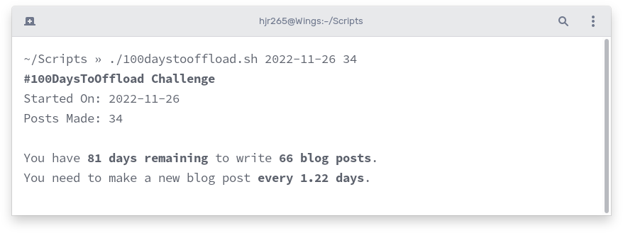

I am getting quite close to my 1-year mark since I started the #100DaysToOffload challenge. Some _quick mafs_ tell me that I can't skip that many days if I want to make it to 100 blog posts by the end of the 365 days.

I wrote a script that takes the date when I made my [first #100DaysToOffload blog post](/blog/passing-a-vector-of-redismodulestring-to-redismodule-call/) and the number of blog posts I have written through for challenge so far. The script then calculates some numbers to... motivate.



Here's the script:

``` sh
#!/bin/bash

STARTED_ON=$1
POSTS_MADE=$2

STARTED_ON=`date -d "$STARTED_ON" +'%Y-%m-%d'`

ENDS_ON=`date -d "$STARTED_ON+365 days" +'%Y-%m-%d'`

DAYS_LEFT=`expr '(' $(date -d $ENDS_ON +'%s') - $(date +'%s') + 86399 ')' / 86400`
POSTS_LEFT=`expr '(' 100 - $POSTS_MADE ')'`

RATE=`echo "scale=2; $DAYS_LEFT / $POSTS_LEFT" | bc`

BOLD=`tput bold`
PLAIN=`tput sgr0`

echo "${BOLD}#100DaysToOffload Challenge${PLAIN}"
echo 'Started On:' $STARTED_ON
echo 'Posts Made:' $POSTS_MADE
echo
echo "You have ${BOLD}$DAYS_LEFT days remaining${PLAIN} to write ${BOLD}$POSTS_LEFT blog posts${PLAIN}."
echo "You need to make a new blog post ${BOLD}every $RATE days${PLAIN}."
```

Some interesting things that I learned while preparing this script include:

- The use of `date -d` to work on a specific date. For example `date -d 2023-09-03 +%s` will print the given date as seconds since epoch.
- The use of `expr` for some of the maths.
- The use of `bc` for floating-point maths (which `expr` doesn't support).
- The use of `tput` to get the right sequences for formatting texts (that is how we are making some of the output text bold).
