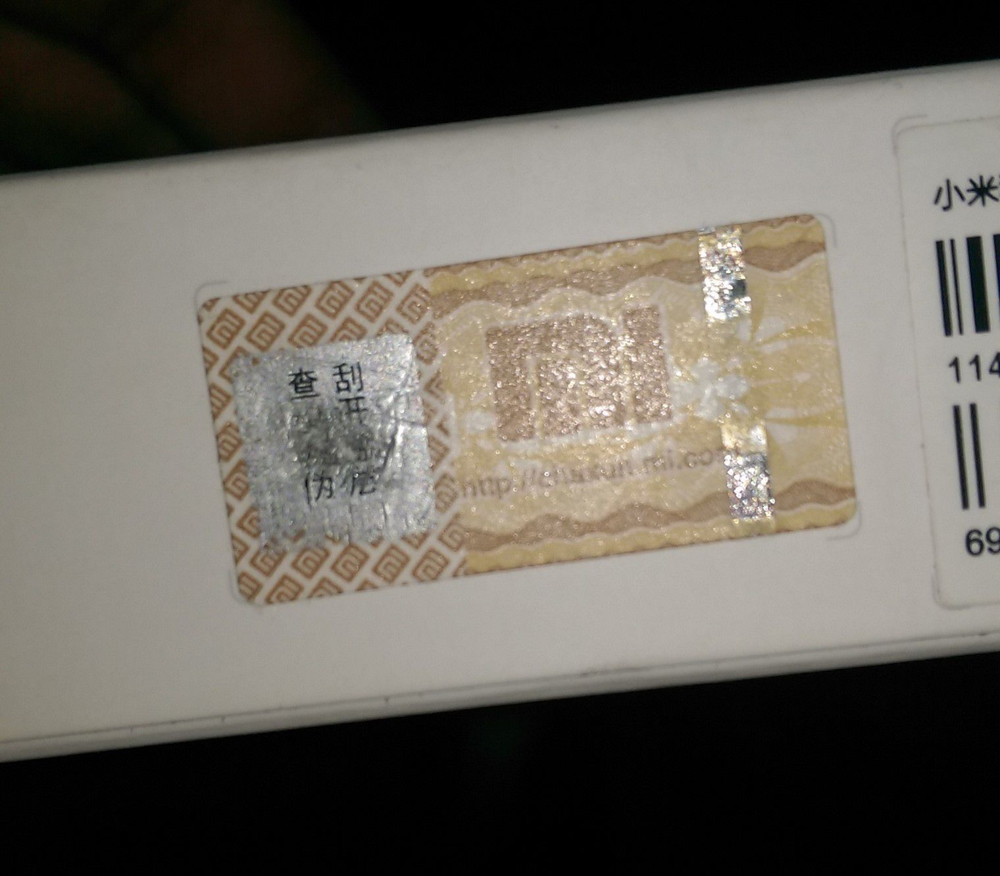
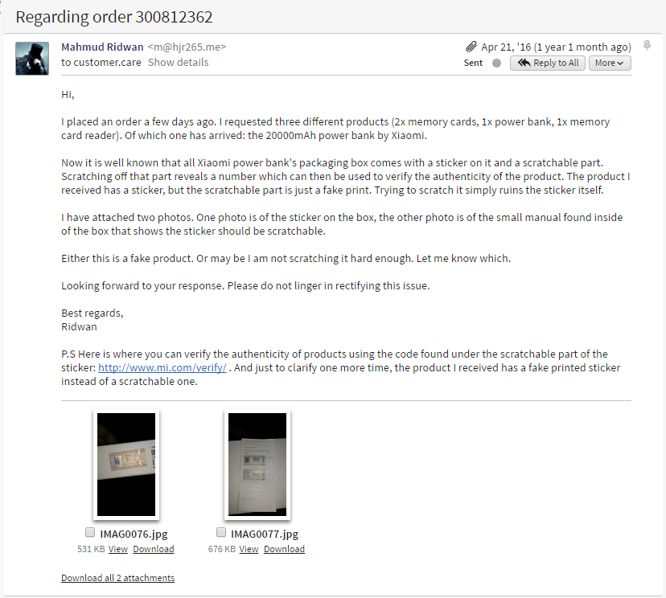

This is just a long overdue rant.

A little over a year ago, I ordered a power bank from a very reputable online store. Compared to my previous experiences with other stores, they seemed super professional. I received a phone call from them to get the order confirmed, and a couple of days later they delivered it right to my doorstep. 

Amazing service! Except, what I received was a fake product.

Every Xiaomi product has a sticker that you can scratch to reveal a number, which you can then use to [verify its authenticity](http://www.mi.com/verify).

And, this is what I got instead of a scratch-off sticker:

A piece of paper that only looked like it could be scratched. Things don't get any faker than this!

Their delivery service was amazing, now it was time to see if their customer service was equally good. It was time for an email to their customer service:

After sending them that email, it took 3 days for them to reply with an acknowledgment and apology. Not bad for a store selling fake products.

After a couple of phone calls, an email, and 16 days, they graced me with another email:

> Please accept our sincerest apologies for the delay. We have forwarded your issue to the concern[ed] department.

And then, I got what they thought I deserved for using their services and receiving a fake product: a store voucher to buy more fake products.

I bought earphones with that voucher code. Do I even need to say they were fake as well?

I thought to myself: thank goodness they don't sell food.

Well, turns out, they are selling onions now (at a price of Tk 9 per kilogram only):

I should have saved that voucher code I suppose. At that price, that's a _ton_ of onions I could have bought. It would have been fun to see what fake onions look like. And, if they are not fake, that's actually a pretty good price.

I wonder how many customers actually realized that they were being sold fake products for the price of the real ones, how many returns they actually had to accept, and how much money they made this way.

It is so frustrating to see these companies build businesses around ideas that feed off customers' innocence. 