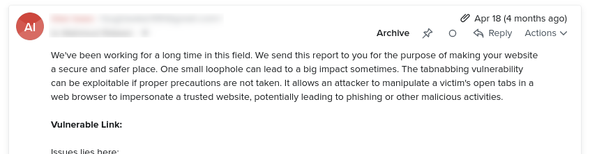

On **April 3, 2023**, I received an email from a "security researcher". They scanned one of my sites and found a "critical urgent" vulnerability.

The web application in question links to a subdomain under the same domain from the footer without the `rel="noreferer noopener"` attribute.

Some will say that a subdomain is not an internal link and it must have that attribute. Fine.

But this email led to a very fun and eye-opening exchange of 36 emails. Is the line between between these "security researchers" and spammers getting blurred by the day?

I will go over a few of those emails in this blog post.

On **April 17, 2023**, I received another email.

Woah. That sounds serious.

On **April 18, 2023**, I replied for the first time.

I asked: So a tab of my site can take over another tab of my site?

On **April 18, 2023**, the "security researcher" repeated a portion of his/her first email.

Canned response?

Through a few more email exchanges I learned a few more different versions of his/her canned responses for "tabnabbing".

I also learned that he/she wanted me to pay him/her $500 for his/her "security research".

After clearly pointing out to him/her that the "security research" report he/she shared is talking about subdomain links only (and not any external links), his response was:

> We send this report to you for the purpose of making your website a secure and safer place.

Such a kind-hearted soul, I think to myself. Must be a bit confused though. Because he/she was ignoring my simple question:

> Is there any link to a third-party website that you can present as an example?

But all I got in return were his canned responses for "tabnabbing". He was also very persistent about the $500 that he/she wanted me to pay him/her.

But for what?

I kept getting payment reminders at regular intervals (a few days apart) for the next few weeks. Until...

By **May 17, 2023**, I was getting a bit tired of these emails. After all, how many canned emails on "tabnabbing" can you read?

I asked the "security researcher" a snarky question: Are you a spammer?

I promised to keep his response a secret. But I think I made him/her a bit upset there.

It was apparently either I pay him/her for the "security research", or he tells everyone on social media how to "tabnab" my site. Maybe that is what angry "security researchers" do. I don't know.

Then he/she made his/her second slip-up: the claim that he/she sent me reports of 5 security vulnerabilities. 

"5? No, you have sent me 10." I told him sarcastically. 

His reply confused me to no bounds.

Did I make him more upset? Why did he just give me another lecture on "tabnabbing".

I almost didn't read his email. But I am sure glad I did.

In that soup of text, the word "SQL" caught my attention. What is that word doing in an email about "tabnabbing"?

He figured out a way to "inject SQL" into my web application that doesn't use a SQL-based database. 🤯

This "security researcher" is a security maven! He is probably the same guy/gal who claimed last year to have hacked my router and collected my search history (a spam story for another day).

I begged him to stop his/her lectures about "tabnabbing" and explain the part about SQL injection. I could have been a bit more polite here. But, I had seen all his/her canned emails about "tabnabbing" by this point. It was getting monotonous. I wanted it to stop.

Silence at last.

Or so I thought.

Just when I had forgotten about the whole ordeal, on **June 19, 2023**, I got another email from the "security researcher".

It was the same email he had sent me in April.

I just had one word:

> Wow

And the not-quite-ethical hacker had a few:

> Kindly don't regret if our experts exploit your vulnerabilities in social media.

But, he finally removed me from his email list.

The end.
