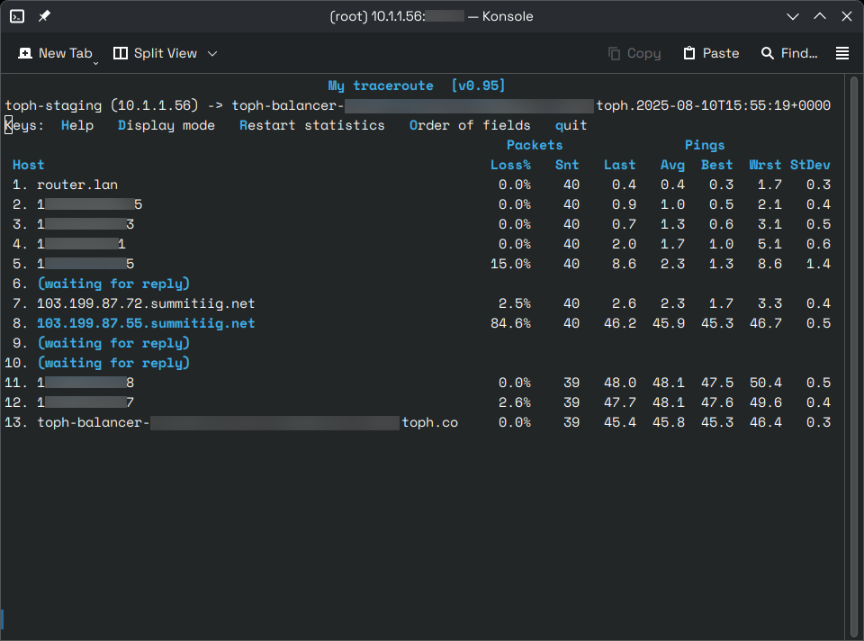
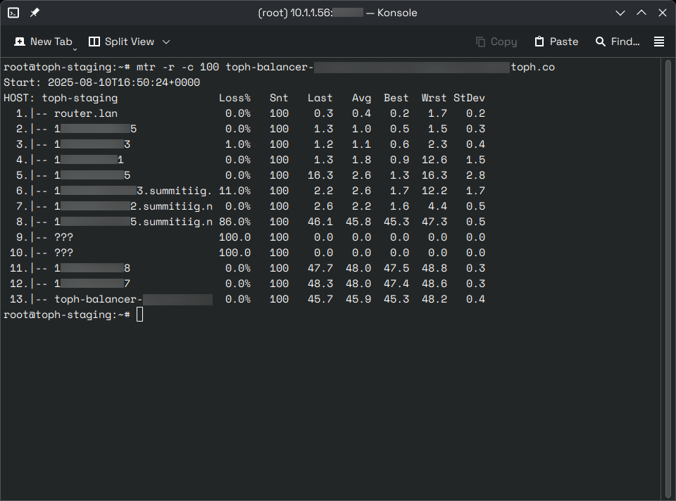

MTR combines the functionality of the traceroute and ping programs in a single network diagnostic tool. And, I am certain internet service providers (ISPs) of third-world countries hate it when customers discover this tool.

I came across the tool again recently while investigating a WireGuard connection issue between an on-premises Toph server and one in Singapore.

Was it our router? Was it Linode's infrastructure? Was it our local ISP?

A quick `mtr` command solved the mystery:

``` sh {linenos=false}
mtr {hostname}
```

Here's what I saw when I `mtr`'d one of Toph's load balancers:



You can also run `mtr` in report mode with the `-r` flag (and `-c` flag to set the number of pings to send).

``` sh {linenos=false}
mtr -r -c 100 {hostname}
```



Whatchu running at number 8, Summit IIG? Your router is leaking like a rusty bucket. 🪇
